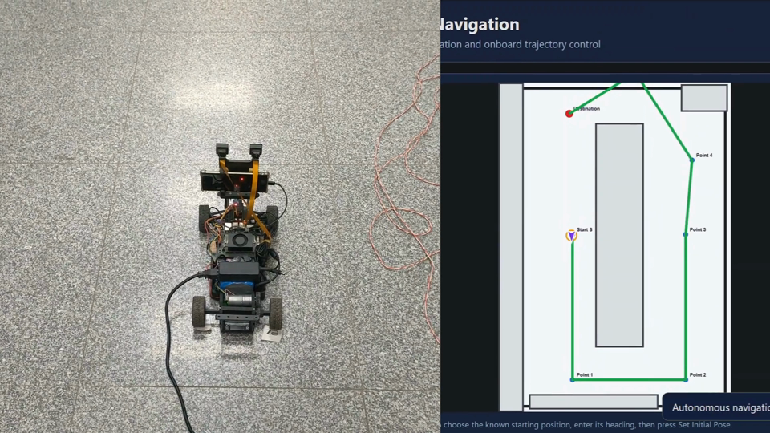

# Motus
<p align="center">
  
</p>

<h1 align="center">Motus Autonomous Vehicle</h1>

Motus is a 1:10 autonomous vehicle prototype for indoor navigation. It uses a Jetson-side control stack, Android phone camera/ARCore data, backend trip planning, and CARLA simulation experiments.

## Demo

[](assets/demos/GP-Demo.mp4)

[View demo video](assets/demos/GP-Demo.mp4)

## Main Features

- Indoor autonomous navigation on a predefined map.
- Android ARCore pose and camera streaming to the Jetson.
- Backend APIs for users, trips, path planning, and map data.
- Jetson manual-control and autonomous-control code.
- CARLA simulation and YOLO object-detection experiments.

## Quick Run
Jetson autonomous server:

```bash
cd Jetson/arcore_jetson_server
./scripts/run_jetson.sh
```

Jetson manual control:

```bash
python Jetson/manual_control/car_control.py
```

CARLA YOLO demo:

```text
Open Simulation/carla/carla_yolo_integration/live_detection.ipynb and run it cell by cell.
```

## Repository Structure

- `Android/` - Android applications for the ARCore stream pipeline and marker sensor work.
- `backend/` - backend application code.
- `generate_cloud/` - standalone notebook for point cloud generation work.
- `Simulation/` - CARLA and model training simulation work.
- `mocking_frontend/` - standalone frontend mockup/prototype.
- `hardware/` - hardware design files.
- `Jetson/` - Jetson-side robot experiment code and workspaces.
